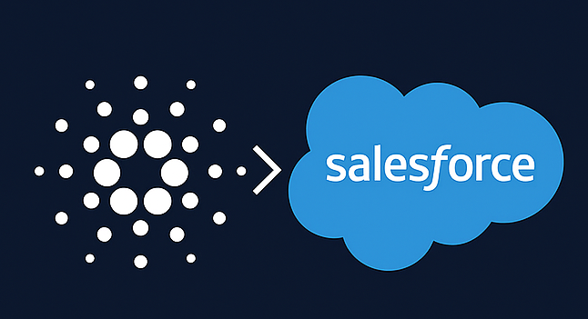

# :rocket: Cardano for Salesforce

## Seamless Blockchain Integration for Salesforce Applications

Cardano for Salesforce is an open source solution for using the Cardano Network to send and receive payments directly in Salesforce. Cardano for Salesforce monitors the blockchain, so it  should work with any popular Cardano wallet users want to use.

## :mag: Key Features

Key features of Cardano for Salesforce include the following. 
* Support for third party wallets
* Full Payable/Payment request tracking, this is a full payment solution.
* Support for Stablecoins that comply with the GENIUS Act.
* On-ramp and off-ramp support without the need for enterprise IT or finance professionals to understand the complexities of a web3 wallet or other Cardano native technologies

## :jigsaw: Use Cases

Potential use cases for Cardano for Salesforce include the following. 
* Paying suppliers, employees and contractors in ADA
* Accepting ADA for as payments for provided goods and services, including automated invoicing and other key workflow management processes 

You can learn more about some of these use cases on the [Web3 Enabler website](https://web3enabler.com/product/blockchain-payments) and [YouTube channel](https://youtube.com/playlist?list=PLt68TvyH77C2JWwoo6AptUrL7WWo5vI7r).

## :package: Installation and Setup

Web3 Enabler offers a simple installation and setup processes to empower enterprise IT and finance professionals to reap the benefits of ADA payments from their existing infrastructure.

Cardano for Salesforce will be an independent open source Salesforce app, as well as an addition (v2.0) to [ADA Wallet for Salesforce](https://appexchange.salesforce.com/appxListingDetail?listingId=48f0a214-c854-4d22-80b8-33e42042b3f4), as well as a public [GitHub repository](https://github.com/MuKnSys/ada-wallet-for-salesforce), which we developed for Catalyst Fund 13 and is available as a as a public [GitHub repository](https://github.com/MuKnSys/ada-wallet-for-salesforce), in addition to the free commercial app listed on the Salesforce AppExchange.

## :world_map: Roadmap

Once Cardano for Salesforce is added to the Salesforce AppExchange listing, the Cardano  Web3 Enabler team will be able to add support for Cardano and its eUTXO model to our commercial Salesforce products, which currently include the following. 
* [Blockchain Payments](https://appexchange.salesforce.com/appxListingDetail?listingId=ee4c011b-7a5b-4a50-91fb-f28049390858), a cryptocurrency and Stablecoin payment solution, which already supports UTXO models as well as Account models
*[Digital Asset Wallet](https://appexchange.salesforce.com/appxListingDetail?listingId=b1884242-f2bb-42c5-b81a-16f209acbfb1), which enables wealth managers using Financial Service Cloud (Salesforce Standard Objects) to have transparency with their client's digital asset holdings

You can learn more about Blockchain Payments and Digital Asset Wallet by checking out our [product demo videos](https://youtube.com/playlist?list=PLt68TvyH77C1-ohVjDQD6DR9XmBKOKnpz&si=Z7OvvWqCGbt91Bcg).

The long-term vision for Web3 Enabler’s partnership with Cardano involves deeper integration for on-ramp and off-ramp solutions, interaction with Salesforce’s new Agentforce AI framework, and deeper integration into the Salesforce Ecosystem.

## :page-facing-up: Copyright and License

Copyright (c) 2025 Web3 Enabler, Inc.  Cardano for Salesforce is distributed under the GPL license, version 3.0.  For more information, see the [LICENSE file](LICENSE).

## :star: Support the Project

Consider starring this repository to help fellow Catalyst community members discover it and cast the votes required to continue our efforts to drive enterprise adoption of Cardano! :handshake:
